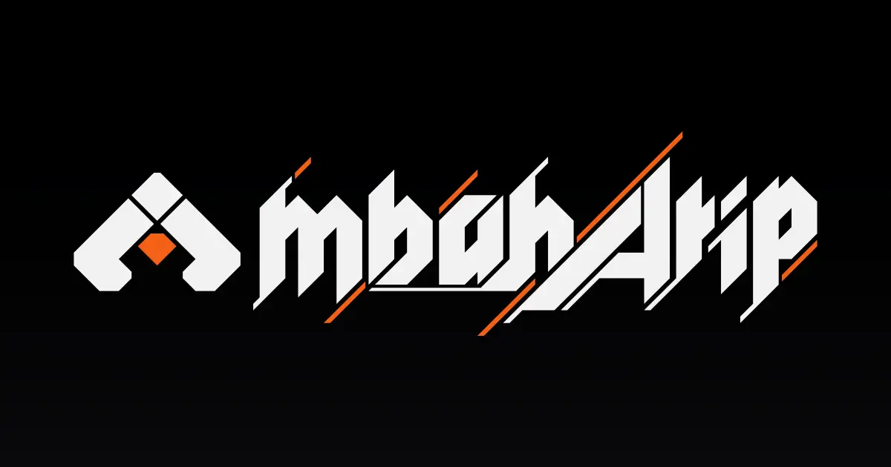

  
  Logo by <a href='https://twitter.com/RINYA_P' target='_blank' rel='noopener noreferrer'>りにゃ (RINYA_P)</a>

---
<!-- ABOUT:START -->
Hello there!👋  
My name is **Arief Rachmawan** — an **Indonesian based web developer**. I usually build thing using **Next.js, Typescript, and TailwindCSS**.

I love Ani Manga Game stuff, so my projects may be focusing around these topic!  
<!-- ABOUT:END -->

---

  <a href='https://www.mbaharip.com' target='_blank' rel='noopener noreferrer'>
    Portfolio Site
  </a>
  |
  <a href='https://www.facebook.com/mbaharip07' target='_blank' rel='noopener noreferrer'>
    Facebook
  </a>
  |
  <a href='https://www.x.com/mbaharip_' target='_blank' rel='noopener noreferrer'>
    X
  </a>
  |
  <a href='https://dev.to/mbaharip' target='_blank' rel='noopener noreferrer'>
    Dev.to
  </a>
  |
  <a href='https://discord.com/users/652155604172931102' target='_blank' rel='noopener noreferrer'>
    Discord
  </a>
  |
  <a href='mailto:support@mbaharip.com' target='_blank' rel='noopener noreferrer'>
    Contact me!
  </a>

