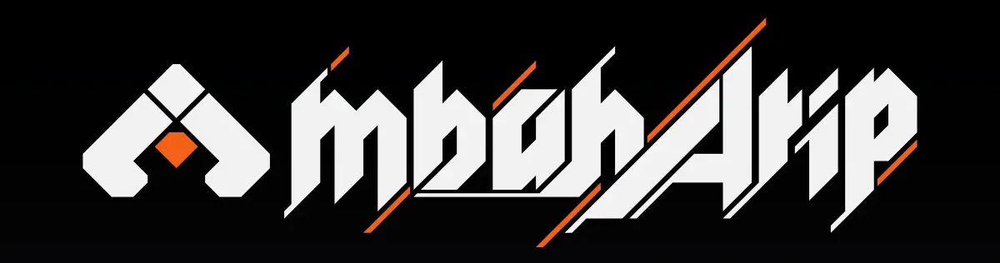

<div align='center'>
  
</div>
<div align='center'>
  <span style='font-size:10px;'>Logo by <a href='https://twitter.com/RINYA_P' target='_blank' rel='noopener noreferrer'>りにゃ (RINYA_P)</a></span>
</div>

<!-- ABOUT:START -->
### Hi there!
I'm **Arief Rachmawan**, a developer based in **Bandung, Indonesia**.  
I specialize in building modern web applications using Next.js, React, and TypeScript, styled with Tailwind CSS. 

Let's create something amazing together!
<!-- ABOUT:END -->


<p align='center' style='color:rgba(110,110,110)'>
  <a href='https://www.mbaharip.com' target='_blank' rel='noopener noreferrer'>
    Portfolio Site
  </a>
</p>


---

### 📊 Wakatime stats

<!--START_SECTION:waka-->

```txt
Total Time: 42 hrs 41 mins

TypeScript           13 hrs 54 mins        ⣿⣿⣿⣿⣿⣿⣿⣷⣀⣀⣀⣀⣀⣀⣀⣀⣀⣀⣀⣀⣀⣀⣀⣀⣀   31.37 %
C++                  8 hrs                 ⣿⣿⣿⣿⣦⣀⣀⣀⣀⣀⣀⣀⣀⣀⣀⣀⣀⣀⣀⣀⣀⣀⣀⣀⣀   18.06 %
Markdown             5 hrs 5 mins          ⣿⣿⣷⣀⣀⣀⣀⣀⣀⣀⣀⣀⣀⣀⣀⣀⣀⣀⣀⣀⣀⣀⣀⣀⣀   11.48 %
Rust                 3 hrs 44 mins         ⣿⣿⣄⣀⣀⣀⣀⣀⣀⣀⣀⣀⣀⣀⣀⣀⣀⣀⣀⣀⣀⣀⣀⣀⣀   08.45 %
PHP                  3 hrs 32 mins         ⣿⣿⣀⣀⣀⣀⣀⣀⣀⣀⣀⣀⣀⣀⣀⣀⣀⣀⣀⣀⣀⣀⣀⣀⣀   07.99 %
```

<!--END_SECTION:waka-->
